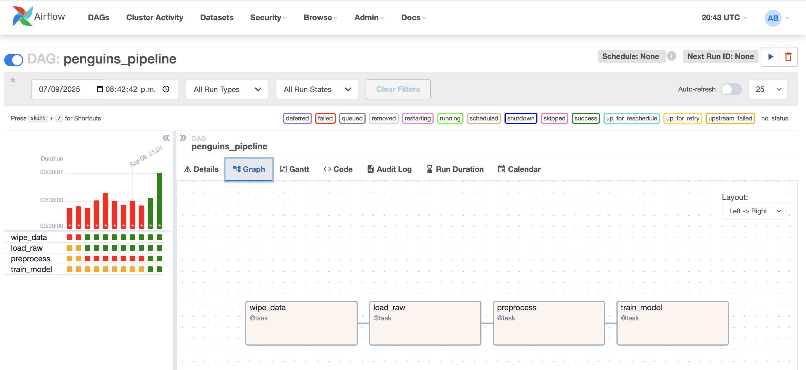
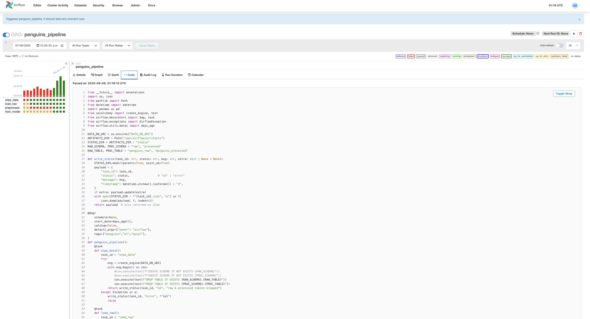
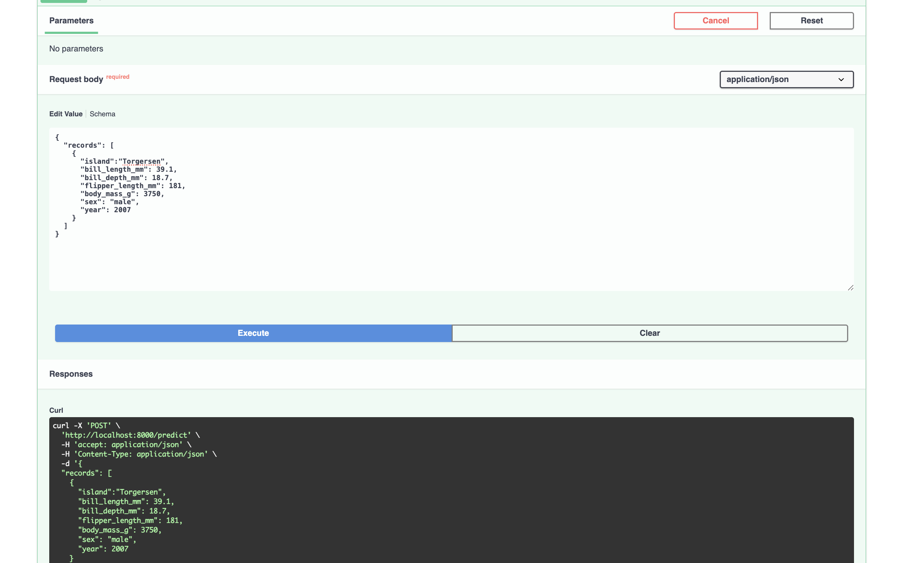

# MLOPS_PUJ_Grupo6
# Orquestación con Airflow, Docker y FastAPI (Proyecto Penguins)
Este documento describe detalladamente los pasos que seguimos para implementar un flujo de trabajo completo con Apache Airflow, Docker Compose, bases de datos PostgreSQL y MySQL, y una API en FastAPI para exponer un modelo de machine learning entrenado con el dataset de Palmer Penguins.
# Objetivo: 
## 1. Objetivo del Taller
El proyecto implementa un pipeline que:
Limpia el contenido de una base de datos MySQL dedicada a datos.
Carga el dataset de Palmer Penguins sin preprocesamiento en la base de datos.
Preprocesa los datos y guarda la versión lista para modelar.
Entrena un modelo de clasificación.
Expone el modelo mediante una API en FastAPI para realizar inferencias.
Todos los servicios (bases de datos, Airflow, y API) se ejecutan en contenedores Docker bajo un mismo docker-compose.yml.

### Estructura de Archivos

## 2. Requisitos previos
Antes de comenzar, nos aseguramos de tener instalado:
Docker Desktop (con soporte para Compose v2).
Git para clonar el repositorio.
uv como manejador ligero de entornos y dependencias (opcional pero recomendado).

En Mac con Homebrew:
brew install git uv
brew install libpq mysql-client
echo 'export PATH="/opt/homebrew/opt/libpq/bin:$PATH"' >> ~/.zshrc && source ~/.zshrc
 
## 3. Clonar el repositorio
Clona el proyecto en tu máquina:
git clone <url-del-repositorio>
cd MLOPS_PUJ_Grupo6/Niveles/2/Taller_2
 
## 4. Levantar la infraestructura
Construcción inicial
 
docker compose build --pull --no-cache

Verificar configuración
docker compose config
 
Iniciar servicios básicos
docker compose up -d postgres mysql_data
docker compose ps
 
## 5. Inicializar Airflow
Airflow requiere una base de datos interna para almacenar metadatos.
Ejecuta:
 
docker compose up --no-deps airflow-init

Esto:
Inicializa la base de datos de Airflow (PostgreSQL).
Crea el usuario administrador de Airflow.
Luego levanta el webserver y scheduler:
 
docker compose up -d airflow-webserver airflow-scheduler
 
La interfaz web de Airflow estará disponible en:
 
http://localhost:8080
Usuario: airflow

Password: airflow
 
## 6. Ejecutar el DAG
En la interfaz web de Airflow activa el DAG llamado penguins_pipeline y lánzalo manualmente.
El DAG contiene las siguientes tareas:
wipe_data: borra tablas de datos previas.
load_raw: carga el dataset sin procesar.
preprocess: limpia y transforma los datos, guarda resultado en MySQL y exporta el preprocesador.
train_model: entrena un modelo de clasificación, guarda métricas y modelo entrenado.
Los resultados y artefactos (modelo, preprocesador, métricas) se almacenan en el volumen artifacts.

### Resultados de Airflow

## 7. API de inferencia con FastAPI
El servicio API se levanta con:
 docker compose up -d api
 Verificar estado de la API
 curl http://localhost:8000/health

### Levantar la API
 

 

Respuesta esperada (JSON):
{"status": "ok", "preprocessor": true, "model": true}

Realizar una predicción
curl -s -X POST http://localhost:8000/predict \

  -H "Content-Type: application/json" \

  -d '{

    "records": [

      {"island":"Torgersen","bill_length_mm":39.1,"bill_depth_mm":18.7,

       "flipper_length_mm":181,"body_mass_g":3750,"sex":"male","year":2007}

    ]

  }'

 
Respuesta esperada:
{"predictions": ["Adelie"]}

 
8. Apagar y reiniciar todo
Apagar servicios
 
